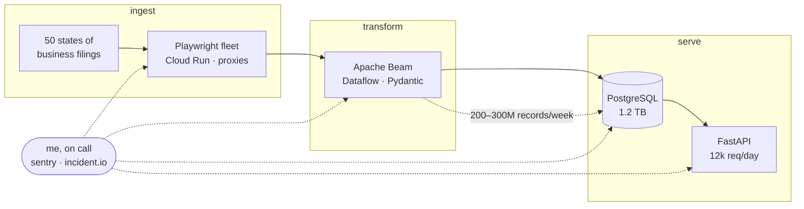

I design and run large-scale data pipelines at [Base Layer](https://www.baselayer.com). Off the clock I'm building [real-swe.com](https://www.real-swe.com) — practice software engineering the way it actually works: real codebases, real debugging, no puzzles.

### The system, roughly

### Shipped

|  |  |
|---|---|
| [**real-swe**](https://www.real-swe.com) | full-stack SWE practice platform — FastAPI, Postgres, Redis, Monaco IDE, Judge0 sandboxed execution, Stripe billing |
| [**Karika Motors**](https://karikamotors.com) | luxury car-rental fleet in Cairo — filterable fleet, WhatsApp reservation flow |
| [**JavaLens**](https://github.com/ehab20011/java-lens-mac) | JavaFX packet sniffer with a Wireshark-style UI; port-mirrored a managed switch to capture a whole home network into Postgres |
| [**PPP Data Analyzer**](https://github.com/ehab20011/baselayer) | containerized ETL over millions of PPP loans, natural-language → SQL querying |

### Reach me

[LinkedIn](https://www.linkedin.com/in/ehab-abdalla-04ab411b3/) · [ehababdalla03@gmail.com](mailto:ehababdalla03@gmail.com)
